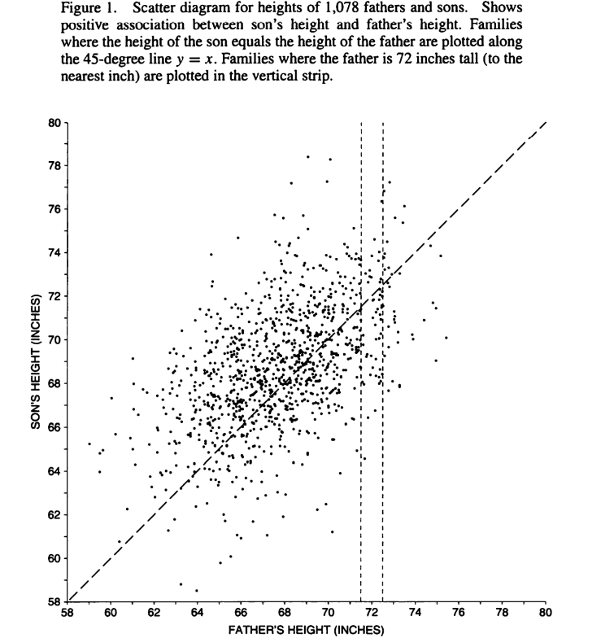

# Correlation: the good and the bad

When there are more than one variables available in a data set, measures are needed to quantify associations among the variables. For example, one can consider Karl Pearson's experiment to find the relation between father's height and son's height.

Pearson measured the height of 1078 fathers, and their sons at maturity. The scatter plot of father's height (x-axis) and son's height (y-axis) is given below:

{width="359"}

Although the scatter plot shows an association between father's height and son's height, it is important to know the strength of the association. If the association is strong enough, then by knowing one of these variables helps a lot in predicting the other.

**Pearson's correlation coefficient**

-   When both the variables under consideration, say $x$ and $y$, are of continuous type, and the association between $x$ and $y$ appears to be linear (from the scatter diagram), then the correlation coefficient is an appropriate measure of association between the two variables.

-   Let $X$ and $Y$ be two random variables, then the population correlation coefficient is:

    $$
    \rho_{X,Y} = \text{Corr}(X,Y) = \dfrac{\text{Cov}(X, Y)}{ \sqrt{\text{Var}(X)\, \text{Var}(Y)}}\,.
    $$

-   A way to estimate the correlation from data $\{(x_i, y_i)\}_{i=1}^{n}$ is by the sample correlation

    $$
    \hat{\rho}_{X,Y} = \dfrac{n^{-1} \sum_{i=1}^{n} (x_i - \bar{x}) (y_i - \bar{y})}{s_x s_y}\,,
    $$\
    where $\bar{x}$ and $\bar{y}$ are sample means and $s_x$ and $s_y$ are sample standard deviations for $X$ and $Y$, respectively.

## Some things are not what they seem

The correlation between two variables in some sense, measures the (linear) dependency between them. Correlation is between -1 and 1.

-   Correlation = -1: perfectly negatively correlated

-   Correlation = 0: not correlated

-   Correlation $\approx$ .5: moderately positively correlated

-   Correlation = 1: perfectly positively correlated\

### Problems

1.  Load the `auto-mpg.csv` dataset in `R`. This dataset contains information on how different car characteristics affect the "miles per gallon" in a car.\
    \
    You may find more information about the dataset here:<https://www.kaggle.com/datasets/uciml/autompg-dataset>\
    \
    Find the correlation between acceleration and miles per gallon in this dataset using the `cor` function. What do you conclude?

2.  Plot the acceleration on the $x$-axis and the miles per gallon on the $y$-axis. Also, add the "line-of-best-fit" to this data using

    ```{r}
    #| eval: false

    # assuming dataset loaded is called dat
    abline(lm(dat$mpg ~ dat$acceleration))
    ```

    What do you conclude regarding the relationship between `mpg` and `acceleration`?\

3.  Plot the acceleration on the $x$-axis and the miles per gallon on the $y$-axis, and now color the points based on the number of cylinders of the car.

    a.  Can you make separate "line-of-best-fit" for each type of cylinder?

    b.  What do you now conclude about the relationship between acceleration and MPG?\

4.  The above is an example of **Simpson's Paradox**. Simpson's Paradox happens when a trend appearing in groups disappears when data is combined.\
    \
    More statistically, the joint distribution of two variables can change drastically, when conditioned on a third random variable.\
    \
    Loosely speaking, can you think of Simpson's paradox in Tennis?\

5.  The `iris` dataset is available in R by default. Find an instance of Simpson's Paradox in this dataset.\

6.  Load the `fire-dat.csv` dataset that saves the following information on 500 different fires: (i) `injured` - the number of people injured in the incident (ii) `firefight` - the number of firefighters deployed in the incident.

    a.  What do you conclude about the impact of the number of firefighters deployed on the number of injuries?

    b.  If you were working for the fire department, what changes would you recommend to lower number of injuries?\

7.  Load the `fire-intense.csv` dataset that saves the following information on 500 different fires: (i) `injured` - the number of people injured in the incident (ii) `firefight` - the number of firefighters deployed in the incident (iii) `intensity` - the fire intensity measured by some method.

    Would your answer to the previous question change with this new dataset? What do you learn from this?\
    \

    The variable `intensity` here is a confounding variable. A confounding variable *causes* an affect on other variables in a such a way that it seems like the other variables are causing an affect of each other.\

    [**Correlation does not imply causation.\
    **]{.underline}

8.  What might be a confounding variable in the examples below:

    a.  It is seen that home thefts is positively correlated with amount of ice-cream consumption.

    b.  It is seen that height is positively correlated with amount of weight a person can lift.\
