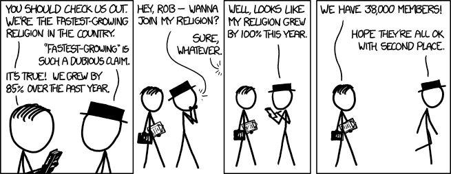
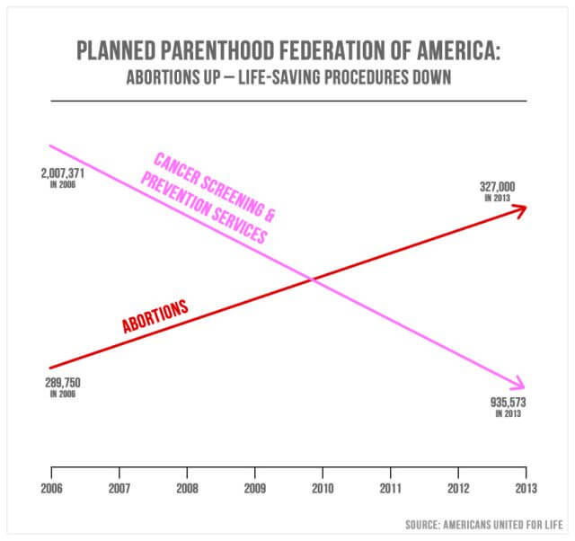
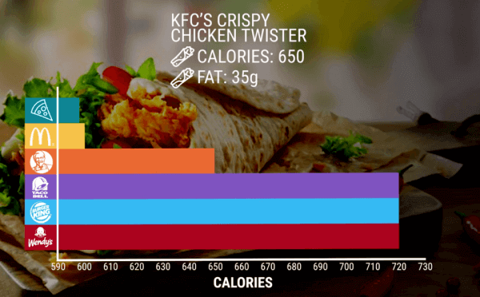
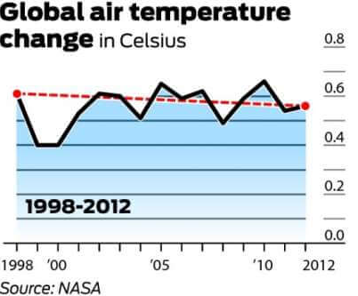
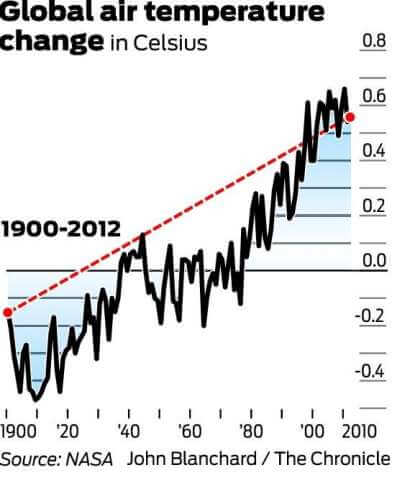

## Misleading Statistics

{width="415"}

We have now learned about statistical paradoxes and statistical biases. Many such biases and paradoxes are misused in the real world. Some of these are on purpose and some are due to lack of understanding. As a statistician and a data scientist, we must *always* look at statistics in the media and advertising critically. For any numbers reported from a study, it is good to ask

-   who researched the study
-   why was the study done
-   who paid for the study
-   how were the samples collected

In this worksheet, we will go through a few examples of misleading statistics and visualizations.

### Problems

1.  On hand-wash and sanitizers, it is often written and advertized that they "[kills 99.8% of the bacteria!]{.underline}". Do you think this is misleading?\

2.  The following news article appeared in The Guardian (UK), titled: "Male drivers three times more likely to be in road collisions with pedestrians"\
    <https://www.theguardian.com/world/2022/oct/09/male-drivers-three-times-more-likely-road-collisions-pedestrians>\
    \
    Do you think the article has done a complete analysis of the problem? Are there variables or data they have not accounted for? Can you think of a possible confounding variable here?\

3.  Colgate, in the early 2000s, had the tagline in their advertisements: "[More than 80% of Dentists recommend Colgate.]{.underline}"

    -   What do you conclude from such a tagline?

    -   Colgate had gotten this number from a survey they did of dentists where the survey asked dentists to check toothpastes that they would recommend people use. The dentists could choose as many options as they wanted.\
        Knowing this information, do you think Colgate's tagline was misleading?\

4.  Misleading visualizations are the most common way of misleading readers. Consider the following example.\
    \
    Planned Parenthood is a healthcare organization in the USA, focusing on women's healthcare. In the USA, politician Jason Chaffetz, during a hearing, presented the following chart to the President of Planned Parenthood:\
    {width="535"}

    Mr. Chaffetz concluded that over the last 7 years Planned Parenthood has done more abortions than "life-saving procedures".\

    Look at the plot carefully. What problems do you see with it?\
    \
    PolitiFact is a fact-checking website, which discussed the issues with this plot and presented a more accurate plot: <https://www.politifact.com/factchecks/2015/oct/01/jason-chaffetz/chart-shown-planned-parenthood-hearing-misleading-/>\

5.  KFC produced the following graph to advertise their crispy chicken twister. Do you think the graph is misleading?\
    {width="468"}\

6.  The following graph is often shared to disprove climate change.\
    \
    {width="381"}

    The interpretation being that in the 14 years, the global air temperature has been stable, and if anything, has reduced!\
    Average yearly temperatures fluctuates fairly often. Choosing a 14 year window is too small for seeing a trend in the data. What do you conclude, when the window is increased:\
    \
    {width="360"}

    Can you guess why 1998 was chosen as the starting of the axis in the first plot?\

7.  Consider the Accidental Deaths datasets in `MASS` library.

    ```{r}
    #| eval: true
    library(MASS)
    data(accdeaths)
    ```

    I show the following plot to conclude that there is no seasonality in accidental deaths. Is the plot misleading? Can you make a plot of accidental death versus time by yourself to check?

    ```{r}
    #| echo: false
    plot(accdeaths, ylim = c(0, 1e5), ylab = "Accidental Deaths")
    ```

8.  Consider the `anorexia` dataset in library `MASS`, which contains the weight of female anorexia patients given three different treatments: "Control" (no treatment), "CBT" (Cognitive Behavioural treatment) and "FT" (family treatment).\
    \
    Below is a histogram of all patients before and after treatment. Do you think this is the best visualization possible? Can we conclude anything? Can you try to make a better visualization?

    ```{r}
    #| echo: false
    data(anorexia)
    hist(anorexia$Postwt, xlab = "Weight", ylim = c(0, 30),
         main = "Histogram of Weights")
    hist(anorexia$Prewt, add = TRUE,
         col = adjustcolor("blue", alpha.f = .3))
    legend("topright", legend = c("After", "Before"),
           fill = c("grey", adjustcolor("blue", alpha.f = .3)))

    ```

    \

9.  For your course project, discuss with your group members if you've come across any misleading statistics. Further, be sure to check that you aren't producing misleading plots and conclusions.
